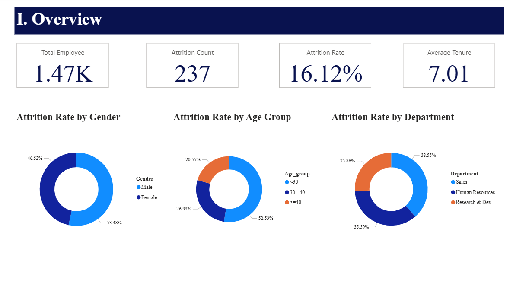

**HR-Analytics-Employee-Attrition**

**A. Project Overview**

- This project analyzes employee attrition in X company.
- The focus is on identifying key risk factors and providing actionable insights to support HR in improving retention.

_Explore more insights in the full Power BI dashboard_

**B. Dataset Information**

**Source**

- Kaggle Dataset: https://www.kaggle.com/datasets/pavansubhasht/ibm-hr-analytics-attrition-dataset/data
- In my Analysis, Performance Rating was dropped since most employees were rated as 3 or 4, leading to very low variance and limited predictive power.
- Irrelevant or constant variables (EmployeeNumber, EmployeeCount, Over18, StandardHours, etc.) were removed during preprocessing to keep the dataset clean and focused on impactful features.
- Monthly income was not segmented across the whole company because compensation is inherently tied to JobRole/JobLevel. Without a market salary benchmark or within-role normalization, such segmentation would be misleading, so it was excluded.

**Period**

This dataset was last updated around 8 years ago, and reflects historical HR patterns rather than current trends.

**C. Methodology**

Data Cleaning (Python) → Descriptive Analysis → Actionable Insights

**D. Key Findings and Actionable Plans**

**Key Findings**

- Overall attrition rate 16.1%, average tenure ~7 years → few long-tenured staff, hinting at weak retention/benefits.
- R&D holds the largest share of employees (65%)
- Employees is mainly get married (45.78%)
- Employees with lower engagement scores are more likely to leave; strong manager–employee relationships reduce attrition.
- High-risk groups include new hires (<2 years) and employees with 5+ years without promotion; however, the most alarming is overtime staff, with an attrition rate of 74.5% - an urgent issue that requires immediate action.

**Actionable Plans**

- Short-term Goal (Emergency):
  + Improve efficiency through process optimization and targeted training to help employees work smarter, more efficient.
  + Conduct headcount balancing to identify workload concentration and reallocate or hire additional staff if needed.
  + Quick wins: implement fair shift scheduling to avoid chronic overtime within certain teams.
- Enhance Engagement Score factors:
  + Environment Satisfaction, Job Satisfaction & Relationship Satisfaction:
    Improve workplace conditions and overall employee experience.
    Regularly gather feedback and align tasks with employee strengths.
    Foster positive team dynamics and strengthen manager - employee communication.
    Introduce internal mobility programs, allowing employees to transfer across departments instead of leaving.
  + Work–Life Balance: Enforce fair workload distribution and flexible arrangements where possible.
  + Job Involvement: Increase role clarity and recognition to boost employee commitment.
- Promotion & Career Growth:
  + Review and adjust promotion cycles/range to ensure employees see a clear path for career advancement.
  + Hold managers accountable for talent development by tying part of their KPIs to team promotion, training, and retention metrics.

**E. About Me**

Hi, I'm Navin (Bao Vy) – an aspiring Data Analyst passionate about turning raw data into actionable business insights. I’m eager to contribute to data-driven decision making and help organizations translate analytics into business impact. 
For more details, please reach out at: 

- 📊 Skills: SQL, Python, Power BI.  
- 🌐 LinkedIn: https://www.linkedin.com/in/navin826/
- 📂 Portfolio: https://github.com/CallmeNavin/  
